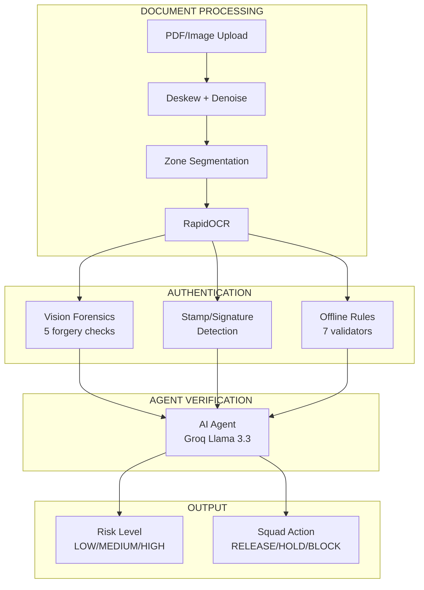

# LandCheck - AI Document Verification for Nigerian Land Records

[](https://opensource.org/licenses/MIT)
[](https://www.python.org/downloads/)
[](https://fastapi.tiangolo.com/)

*AI-powered document verification for Nigerian Certificates of Occupancy to reduce land fraud risk for buyers, banks, lawyers, and regulators.*

---

## Features

- `??` Document Intelligence: zone-aware OCR with field extraction.
- `??` Vision Forensics: multi-check image tamper analysis.
- `??` Verification: forensic rules and validators.
- `??` AI-Powered Reports: human-readable markdown verification output.
- `??` REST API: FastAPI endpoints for JSON and report workflows.
- `???` Open Source: modular architecture for extension and auditability.

---

---

| Zone | What Happens | Technologies |
|------|--------------|--------------|
| **DOCUMENT PROCESSING** | Deskew, denoise, zone segmentation, OCR | OpenCV, RapidOCR |
| **AUTHENTICATION** | Vision forensics (5 checks), stamp/signature detection, rules (7 validators) | ELA, Noise, Edge, Luminance, Contour Analysis |
| **AGENT VERIFICATION** | Signal aggregation | Groq Llama 3.3 70B |
| **OUTPUT** | Risk level + Squad action | LOW/MEDIUM/HIGH → RELEASE/HOLD/BLOCK |
---

## Live Demo

Deployed endpoint:

`https://ai-landcheck.onrender.com/`

Test command:

```bash
curl -X POST -F "file=@test.png" https://veritas-api.onrender.com/verify
```

---

## Table of Contents

- [Installation](#installation)
- [Environment Variables](#environment-variables)
- [Quick Start](#quick-start)
- [Usage](#usage)
- [API Documentation](#api-documentation)
- [Risk Levels Table](#risk-levels-table)
- [Verification Pipeline](#verification-pipeline)
- [Project Structure](#project-structure)
- [Deployment](#deployment)
- [Troubleshooting](#troubleshooting)
- [Contributing](#contributing)
- [License](#license)
- [Acknowledgements](#acknowledgements)
- [Contact](#contact)

---

## Installation

### Prerequisites

- Python `3.11+`
- `pip`
- Optional: Groq API key for LLM-backed reporting

### Step 1: Clone the repository

```bash
git clone https://github.com/your-username/veritas.git
cd veritas
```

### Step 2: Create a virtual environment

Windows (PowerShell):

```bash
python -m venv .venv
.\.venv\Scripts\Activate.ps1
```

Mac/Linux:

```bash
python3 -m venv .venv
source .venv/bin/activate
```

### Step 3: Install dependencies

```bash
pip install -r requirements.txt
```

### Step 4: Create environment file

```bash
cp .env.example .env
```

Windows alternative:

```bash
copy .env.example .env
```

### Step 5: Edit environment variables

Open `.env` and add your values.

---

## Environment Variables

Use this template in `.env`:

```env
GROQ_API_KEY=
```

Variable details:

- `GROQ_API_KEY` (optional): Groq API key for report/agent capabilities. Get from https://console.groq.com

Security notes:

- Never commit `.env` to git.
- Rotate keys if exposed.
- Use different keys per environment (dev/staging/prod).

---

## Quick Start

```bash
python api_server.py
curl http://localhost:8000/health
curl -X POST -F "file=@test.png" http://localhost:8000/verify
```

Expected response shape (`/verify`):

```json
{
  "verification_id": "VRT-20260514_170015",
  "overall_risk": "MEDIUM",
  "trust_score": 71,
  "squad_action": "HOLD_FUNDS_IN_ESCROW",
  "processing_time_seconds": 3.82,
  "report": "# VERIFICATION REPORT: ..."
}
```

---

## Usage

### As a Python Library

```python
from verification_engine.OCR.extraction import LandVerifyOCR

engine = LandVerifyOCR(enable_vision=True, sensitivity="medium")
result = engine.process_image_file("test.png")
print(result.keys())
```
```

---

## API Documentation

| Method | Endpoint | Description |
|--------|----------|-------------|
| GET | `/` | API information |
| GET | `/health` | Health check |
| POST | `/verify` | Verify document, return JSON |
| POST | `/verify/report` | Verify document, return markdown |
| GET | `/docs` | Interactive Swagger docs |

### `POST /verify` request

```bash
curl -X POST -F "file=@test.png" http://localhost:8000/verify
```

### `POST /verify` response example

```json
{
  "verification_id": "VRT-20260514_170015",
  "overall_risk": "HIGH",
  "trust_score": 54,
  "squad_action": "BLOCK_PAYMENT",
  "processing_time_seconds": 4.12,
  "report": "# VERIFICATION REPORT: test.png\n..."
}
```

### `POST /verify/report` request

```bash
curl -X POST -F "file=@test.png" http://localhost:8000/verify/report
```

### `POST /verify/report` response example

```markdown
# VERIFICATION REPORT: test.png
## EXECUTIVE SUMMARY
...
```

---

## Risk Levels Table

| Risk | Trust Score | Squad Action | Meaning |
|------|-------------|--------------|---------|
| LOW | 80-95 | RELEASE_PAYMENT | Likely authentic with no major concerns |
| MEDIUM | 60-79 | HOLD_FUNDS_IN_ESCROW | Suspicious indicators require review |
| HIGH | 40-59 | BLOCK_PAYMENT | Likely forged or materially inconsistent |
| CRITICAL | <40 | BLOCK_PAYMENT | Strong fraud indicators, do not proceed |

---

## Verification Pipeline

### Stage 1: Document Intelligence (Zone-aware OCR)

Document pages are segmented and parsed into text, coordinates, confidence, and structural zones for downstream verification.

### Stage 2: Vision Forensics (5 checks)

| Check | What it detects |
|------|------------------|
| Error Level Analysis (ELA) | Edit/compression artifacts |
| Noise Consistency | Patch-region noise mismatch |
| Luminance Uniformity | Multi-source composition artifacts |
| Edge Sharpness | Pasted-content edge mismatch |
| Text Integrity | Character-level tamper signals |

### Stage 3: Verification (7 tools)

| Tool | Focus |
|------|-------|
| Reference Number Forensics | C of O and registry pattern validity |
| Font/Typography Consistency | Local text rendering anomalies |
| Internal Date Logic | Temporal plausibility checks |
| Print/Scan Consistency | Physical scan behavior consistency |
| Government Template Matching | Required language/template fidelity |
| Image Provenance | Metadata and generation clues |
| Barcode/Security Feature Check | e-C of O security marker presence |

### Stage 4: AI Agent (aggregation and scoring)

Signals from OCR, vision, and offline checks are aggregated into a trust score, risk label, and recommended squad action.

### Stage 5: Output (JSON + Markdown)

The system returns structured JSON for systems integration and markdown reports for legal, banking, and buyer workflows.

---


### Local Development

```bash
python -m venv .venv
source .venv/bin/activate  # Windows: .\.venv\Scripts\Activate.ps1
pip install -r requirements.txt
python api_server.py
```

---

## Troubleshooting

| Issue | Solution |
|-------|----------|
| `GROQ_API_KEY` not set | Add `GROQ_API_KEY` in `.env` if you use LLM-backed features |
| `ModuleNotFoundError` | Run `pip install -r requirements.txt` in the active virtual env |
| Port `8000` in use | Start on another port, e.g. `uvicorn api.main:app --port 8001` |
| OCR confidence low | Use high-resolution scans with clear contrast and minimal blur |

---

## Contributing

Please read `contributing.md` and follow this setup:

```bash
git checkout -b feature/your-change
pip install -r requirements.txt
python -m compileall api verification_engine
```

Open a pull request with a clear summary, test evidence, and sample input/output where relevant.

---

## License

This project is licensed under the MIT License. See `LICENSE` for full text.

---

## Acknowledgements

- Squad Hackathon
- Groq
- Open Source Community

---
